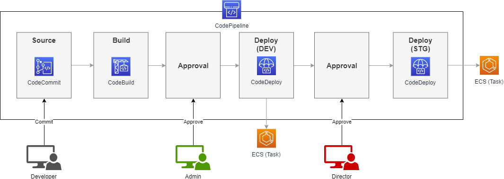
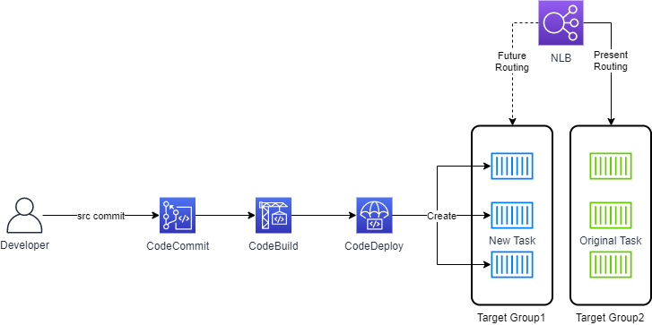
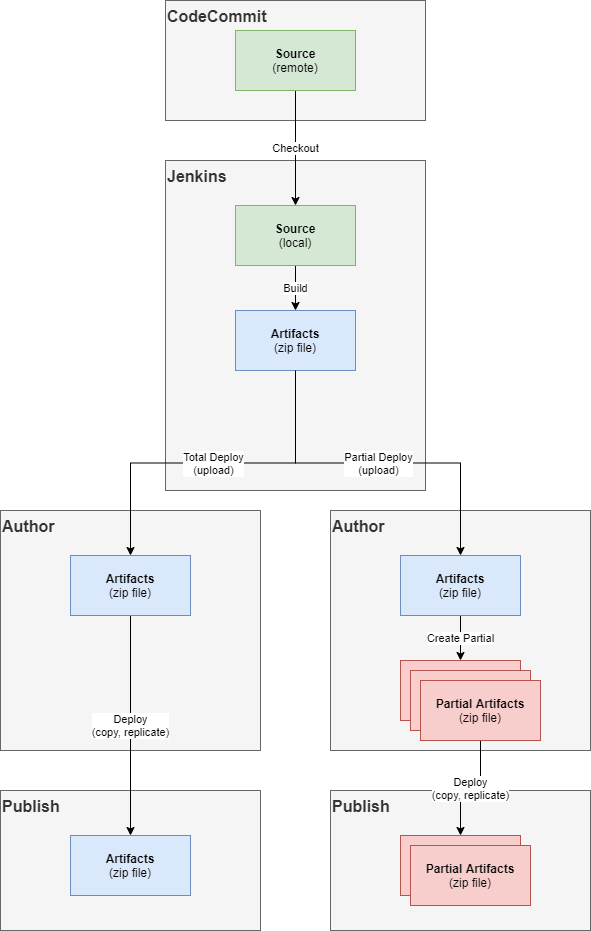
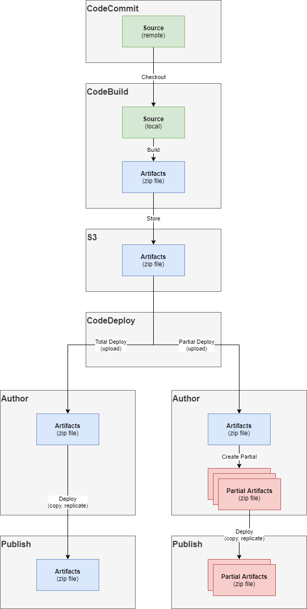

CI / CD
=======

상시 업무

Jenkins
-------

* 대상 : 자사(ibizsoftware) 개발자.
* yarn(node), maven, ant, pipeline 등 이용.
*	자사 개발자들의 요청이 있을 시 Jenkins 시나리오 구성 후 인계.
* jenkins pipeline 사용.

AWS CodePipeline
----------------

CodeCommit - CodeBuild - CodeDeploy 를 구성하는 CodePipeline 구성.

* Source - CodeCommit, Github, Gitlab으로 구성. (작성중인 현재 Bitbucket은 안됨)
* Build - buildspec.yaml 작성.
* Deploy - appspec.yaml 작성. (ECS의 경우 taskdef.json 추가)
* Target - EC2, ECS, S3 등 배포될 target에 따라서 CodePipeline 다양하게 구성.

대한항공 프로젝트에서 추천했던 예시 (ECS)

blue/green 설명시 사용했던 장표 (ECS)

Jenkins - CodeDeploy
--------------------

Jenkins의 관리 편이성과 다양한 모듈의 사용, 접근성등을 고려할때 아직은 AWS CodePipeline보다 장점이
많음. 그러나 Autocaling을 적용한 환경에서는 CodeDeploy를 반드시 이용해야함. 이러한 상황에서
AWS에서 제공하는 Jenkins의 CodeDeploy 패키지를 사용하여 두 장점을 동시에 이용 가능.

대한항공 프로젝트에서 추천했던 비교 예시 : CMS 라는 Adobe 웹 컨텐츠 프로그램 배포 (EC2)

* Jenkins - CodeDeploy 사용

* CodePipeline만 사용

