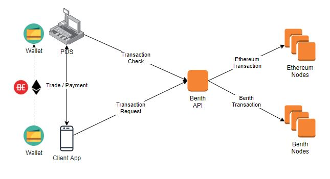

Berith Offline 결제 시스템 개발
================================

기간 : 2018.03 ~ 2018.06

*	고객사 : 자체 서비스 (ibizsoftware)
*	Programming Language : Java, Javascript
*	Technique Used : jwork suite(전자정부프레임워크 기반), jquery, Ajax, mybatis
*	DB : mariaDB
*	내용 : 모바일 웹 & 앱. QR코드를 통해 가맹점과 지갑정보를 정보를 인식하여 이더리움 기반 블록체인에 트랜잭션을 발생시켜 가상화폐로 결제하는 시스템 개발.

