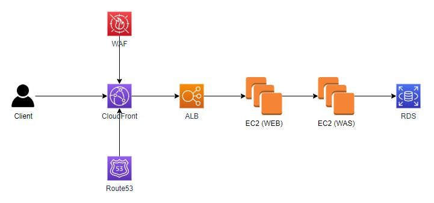
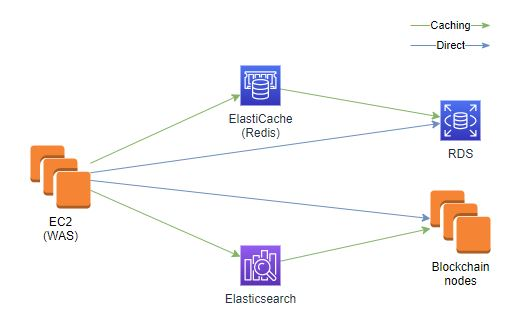
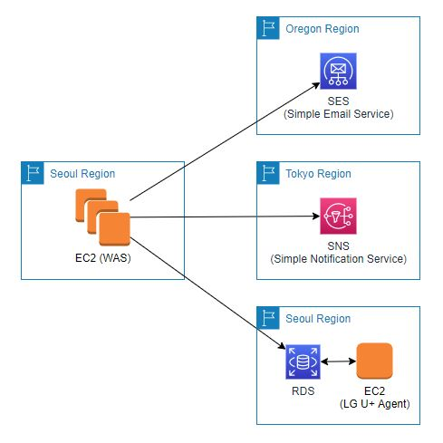
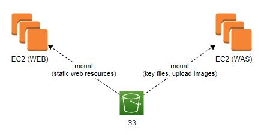

Berith 서버 구축
=================

기간 : 2017.12 ~ 2018.03

*	고객사 : 자체 서비스 (ibizsoftware)
*	Technique Used: AWS(EC2, ELB, S3, RDS, CloudFront, Route53(도메인 호스팅), WAF, ElastiCache(redis), Elasticsearch, Simple Notification Service(국제 sms서비스), Simple Email Service(email 서비스)), Apache (web server), Tomcat 8.5 (was server)
*	내용 : 블록체인 기반 가상화폐 "Berith" 서비스의 서버 설계 및 서버 구축.

Architecture
------------

온프레미스 환경과 거의 유사한 형태로 구성. WEB, WAS는 각각 고가용성 보장을 위해 이중화 되어있는 구조.

Data Caching
------------

데이터를 DB에서 바로 조회하지 않고 memory DB를 활용하여 속도를 높이고 DB 부하를 줄이도록 구성.
AWS에서는 BroadCasting을 지원하지 않기 때문에 이중화된 WAS의 동적 Cluster기능을 사용 할 수 없음.
Unicast방식 또는 Redis를 활용하여 Cluster를 구성해야함. "Berith" 는 블록체인 서비스로서
블록체인 노드에 트랜잭션을 보내고 조회하는 기능을 갖고 있음. 블록체인 노드는 작업증명, 싱크 등
리소스를 많이 사용하는 서비스이기 때문에 대국민 서비스의 트래픽도 감당하기에는 부하가 큼.
이를 해소하고자 Elasticsearch를 활용하여 캐싱 노드 구성.

Notification
------------

"Berith" 는 글로벌 서비스이기 때문에 해외사용자들에 대해서도 Email, SMS등의 서비스를
사용해야하는 필요성이 있음. AWS를 이용하여 쉽게 구성. 특히 SMS 서비스의 경우 국내 사용자에게는
LG U+를, 해외 사용자는 Tokyo Region의 AWS SNS를 사용하도록 구성. LG U+ agent는 batch를 실행하여
지정된 DB table의 레코드를 확인하고 레코드가 있을경우 sms 서버로 발송하는 형태의 시스템.
AWS SNS 서비스는 Restful API 형태로 SDK를 이용하여 레코드마다 was 에서 request를 할 수 있도록
개발.

S3 Usage
--------

"goofys" 라는 오픈소스를 이용하여 s3와 ec2 서버를 mount. nfs처럼 사용할 수 있도록 구성.
이를 이용하여 WEB, WAS의 이중화 구성.

