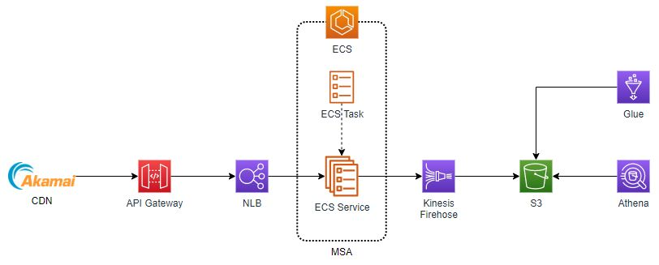
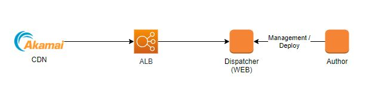
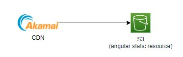
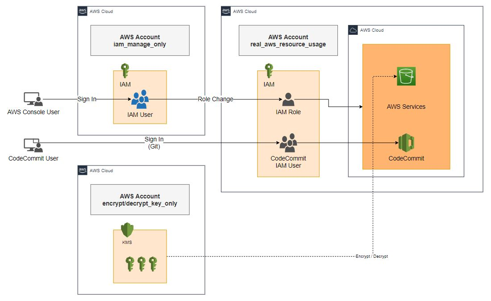

대한항공 홈페이지 개편
=======================

기간 : 2019.10 ~ 현재

*	고객사 : 대한항공
*	대한항공 홈페이지 서버 전체 AWS 전환 및 신규 서비스 개발.
*	AWS 전체 구축 실무 수행. (EC2, RDS, Fargate, ECS, API Gateway, NLB, Lambda, IAM, CodeCommit, CodeBuild, CodeDeploy, CodePipeline, S3, Athena, CloudWatch, CDK, ElastiCache, SNS)
*	AWS Korea, AWS Asia Pacific 과 POC 수행.
* 속도 이슈, Autoscaling 최적화등 blazemeter/taurus를 이용한 테스트 데이터를 기반으로 고도화 작업.

Architecture
------------

Application 영역은 API Gateway, NLB, ECR, ECS Task, ECS Service, ECS Cluster, Fargate를 이용하여 MSA로 구성.
Autoscaling 적용. API Gateway와 NLB의 경우 public - private을 연결하는 구간이 되기 때문에 VPC Link를 생성하여 연결.

CMS의(Adobe 웹 컨텐츠) 경우 Adobe의 라이센스 정책으로 인해 docker를 이용한 Autoscaling이 불가능.
EC2로 설정.

DB는 RDS를 이용하여 구성하였으며 engine은 Aurora로 구성.

로그는 각 ECS에서 Kinesis Firehose를 통해 S3로 일괄 저장. 로그 분석은 Athena를 통해 NoSQL 쿼리하는 방식으로 요구사항에 맞게 분석.

Angular는 SPA이기 때문에 실질적인 html 파일은 index.html파일 하나이고 모든 페이지는
js파일들을 이용하여 클라이언트가 직접 렌더링. 따라서 resource가 없는 url을 호출 했을때
404 error가 발생하지 않도록 하려면 WEB 서버에서 Rewrite 정책 설정이 필요.

IAM 관리
---------

IAM User를 관리하는 별도의 AWS 계정 존재, DEV, STG, PROD stage 별로 계정이 따로 존재.

CI / CD 관리
-------------

.. image:: ../_static/images/ibiz/ci-cd-example.png
.. image:: ../_static/images/ibiz/ci-cd-fargate-bluegreen.png
