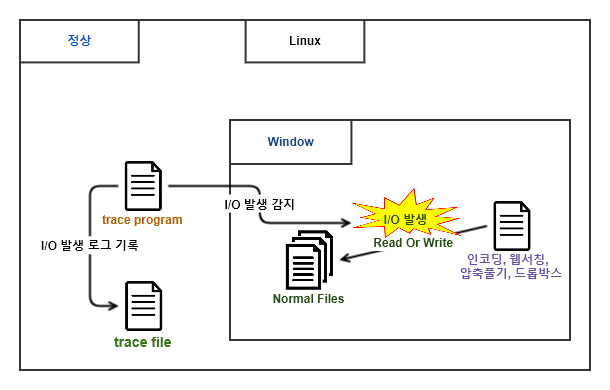

Ransomeware 탐지 알고리즘 개발
==============================

기간 : 2017.08 ~ 2017.09

*	Programming Language : C++
*	내용 : VM으로 일반 사용자 환경의 데스크탑을 구성한 후, 랜섬웨어를 실행. 이때 발생하는 disk io의 정보를 host에서 수집하고 수집된 정보를 AI로 분석하여 정상적인 disk io와 랜섬웨어로 의심되는 disk io의 패턴을 파악. 이렇게 만들어진 솔루션을 ssd에 설치함으로써 랜섬웨어 동작이 의심되는 disk io에 대하여 disk lock 설정.

랜섬웨어를 **Guest VM** 에서 강제로 발생시킨 뒤, **Host** 에서 `disk io` 에 대한 ``trace file_1`` 생성.

**Guest VM** 에서 인코딩, 웹서치, 파일 압축, 다운로 등 정상적인 `disk io` 가 발생 시키는 환경을
만들고 **Host** 에서 disk의 io에 대한 ``trace file_2`` 생성.

``trace file_1`` 을 `감염 사례`, ``trace file_2`` 를 `정상 사례` 로 입력한 뒤 AI 분석을 통해
두 경우를 판별하는 Algorithm 추출.

이렇게 생성된 랜섬웨어 탐지 알고리즘을 SSD에 탑재하여 SSD에서 `disk io` 를 감시하면서
랜섬웨어가 의심되는 경우 disk lock.
