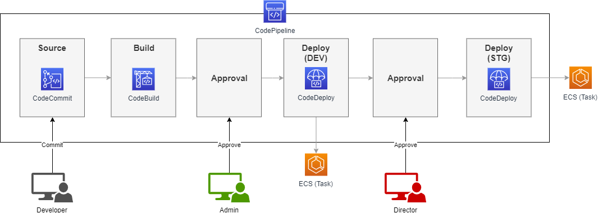

AWS
===

AWS 기술 지원

**Network** : ``VPC`` 와 ``Subnet`` 을 내규된, 또는 적당한 사설 IP 대역으로 지정하여 생성. 각 Subnet의 목적에 맞게
``Routing table`` 구성. Routing table 구성시 inbound, outbound 에 ``Internet Gateway`` 의 여부에 따라서 public / private
network 구성. ``Security Group`` 을 이용하여 각 Subnet 간 접근 룰 정의.

**Domain** : ``Route53`` 을 이용하여 AWS로부터 도메인 호스팅. 서브 도메인의 레코드를 관리. alias를 이용하여 AWS의 각 서비스의
엔드포인트로 바로 연결.

**CDN** : ``CloudFront`` 를 이용하여 정적 웹 리소스 캐싱. ``WAF`` 를 생성하고 SQL Injection, XXS등의 기본적인 보안정책 수립 후
CloudFront에 연결.

**Load Balancer** : 서비스의 성격에 맞게 ``NLB`` , ``ALB`` , ``CLB`` 사용. 각 타입별로 특성이 조금씩 다르기 때문에 서비스의 성격을 고려하여 결정.
access logging, tls 등록, balancing rule 설정. 정적 리소스들에 대한 IP를 타겟으로 지정, 동적 리소스들에 대한 타겟 그룹 지정.

**기존 서버 호스팅 방식** : ``EC2`` 인스턴스 생성. ``KMS`` 를 이용한 access 키 관리. template을 이용한 시작 인스턴스 형상 관리.
다양한 AMI 부팅.

**Severless** : S3를 이용한 정적 웹 서버 구성. ``Lambda`` 와 ``API Gateway`` 를 이용한 Serverless 환경 구성. Restful API, websocket API 구성.

**Kubernetes Management** : ``ECR`` 을 이용한 private container image 관리, ``ECS Task`` 를 이용한 파드 관리, ``ECS Service`` 를 이용한 Deployments 관리,
``ECS Cluster`` 를 이용하여 쉽게 cluster 구성. ECS Cluster의 container onsight 기능을 이용하여 클러스터 내 모든 컨테이너 모니터링. ``Fargate`` 는 AWS에서
제공하는 독자적 형태의 Kubernetes Management 서비스로써, 노드 구성에 대한 편의성 제공.

**Storage** : ``S3``, ``Glacier`` 를 이용하여 적절한 lifecycle을 구성하고 관리. S3를 이용하여 정적 웹 서비스 호스팅 설정.Glue, Athena, Kinesis Data Stream, Kinesis Firehose

**CI/CD** : ``CodeCommit`` 를 이용하여 git remote repository 구성. github, bitbucket등 다른 서비스 이용 가능. CodeCommit의 경우 IAM으로 사용자별 권한 관리.
``CodeBuild`` 를 이용하여 빌드 시나리오 구성. 캐싱, artifacts 관리 등을 이용하여 최적의 빌드 시나리오 구성. ``CodeDeploy`` 를 이용하여
Autoscaling 적용중인 AWS 서비스들에 대해 동적으로 타겟을 찾아 배포. ``CodePipeline`` 을 이용하여 빌드, 배포 시나리오 일괄 구성.

**대용량 분산 데이터** : ``Glue`` 를 이용하여 데이터를 조회 가능한 형태로 가공, 테이블 생성. ``Athena`` 를 이용하여 분산된 대용량 데이터 쿼리. Athena에 대한 기본적인 제약사항은
Athena의 원조인 Presto를 참조.

**Autoscaling** : ``EC2`` , ``ECS`` 등에 적용. CPU, memory utilze 정도에 따라서 scale in/out.

**Message service** : ``Kinesis Data Stream`` 을 이용하여 대용량의 메시지 처리 구성. ``Kinesis Firehose`` 를 통하여 메시지에 따른 액션 설정. 다수의 KCA(Kinesis Client Agent),
KCL(Kinesis Client Library) 을 이용하여 개발한 어플리케이션에서 Kineiss Data Stream으로 대용량의 메시지를 보내고 KPL(Kinesis Procedure Library) 를 이용하여 개발한 어플리케이션 또는
Kinesis Firehose 등에서 메시지를 처리하도록 구성.

**권한 관리** : ``IAM`` 을 이용하여 사용자, 또는 서비스가 AWS의 서비스에 접근할 수 있도록 관리.

권한 관리 참조 자료
https://docs.aws.amazon.com/ko_kr/IAM/latest/UserGuide/tutorial_users-self-manage-mfa-and-creds.html
https://docs.aws.amazon.com/ko_kr/IAM/latest/UserGuide/tutorial_users-self-manage-mfa-and-creds.html#tutorial_mfa_step1
https://docs.aws.amazon.com/ko_kr/IAM/latest/UserGuide/reference_policies_examples_aws_my-sec-creds-self-manage.html
